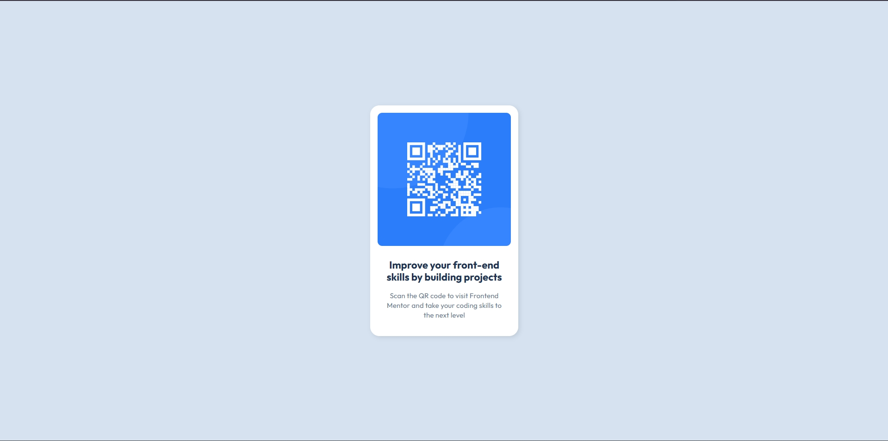

# Frontend Mentor - QR code component solution

This is my solution to the [QR code component challenge on Frontend Mentor](https://www.frontendmentor.io/challenges/qr-code-component-iux_sIO_H). This challenge is a great way to practice basic layout skills and responsive design using only HTML and CSS.

## Screenshot




## Links

- Solution URL: [https://www.frontendmentor.io/solutions/qr-code-component-juanfeoru](https://www.frontendmentor.io/profile/juanfeoru)  
- Live Site URL: [https://juanfeoru.github.io/qr-code-component/](https://juanfeoru.github.io/qr-code-component/)


##  Built with

- Semantic HTML5
- CSS custom properties (variables)
- Flexbox
- Mobile-first workflow

## What I learned

In this project, I reinforced my understanding of:

- How to use Flexbox to center elements both vertically and horizontally
- Applying a mobile-first approach to structure the layout
- Using semantic tags to improve HTML readability and accessibility
- Creating a simple but clean card layout using box-shadow and border-radius

#### Example snippet (Flexbox centering):

```css
body {
  display: flex;
  justify-content: center;
  align-items: center;
  min-height: 100vh;
}
```

##  Continued development

I want to continue improving my understanding of responsive design techniques, especially:
- Better use of media queries
- Organizing CSS for scalability
- Optimizing accessibility in small components

##  Author

- Frontend Mentor - [@juanfeoru](https://www.frontendmentor.io/profile/juanfeoru)
- GitHub - [@juanfeoru](https://github.com/juanfeoru)

## 🙌 Acknowledgments

Thanks to the Frontend Mentor community for providing such helpful challenges that simulate real development tasks.
